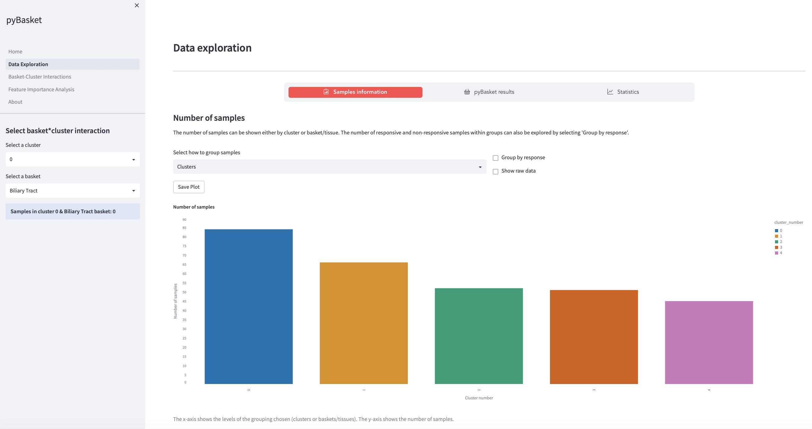

## About

pyBasket is an open-source Python project designed to improve the design and analysis of basket trials in precision medicine. Instead of focusing on a single disease, as in traditional clinical trials, basket trials identify patients sharing a common biomarker and assess their treatments across multiple diseases (or baskets) simultaneously. This method increases efficiency, reduces cost, and aligns well with the objectives of personalized medicine. However, basket trials may suffer from diminished statistical power in the context of smaller patient groups or rare diseases.

Enter pyBasket: a two-stage approach that integrates omics measurements—large-scale molecular data—to bolster patient stratification in basket trials. This process begins by grouping patients based on their omics profiles, using techniques such as k-means clustering. A hierarchical Bayesian model is then employed to estimate overall basket response rates and interactions between baskets and omics clusters. The end result is an increased statistical power and reduction in prediction error, surpassing conventional methods. Moreover, pyBasket provides valuable insights into patient subgroups with varying responses to treatment within the same basket—information that existing alternatives, which exclude omics data, do not readily provide.

pyBasket was tested with the Genomics of Drug Sensitivity in Cancer (GDSC) dataset, emulating a single-step large basket trial. This revealed basket-cluster combinations significantly more responsive to treatment, suggesting our method's potential to uncover molecular reasons for diverse treatment responses. In summary, pyBasket aims to streamline the design of basket trials, enabling more targeted and efficient precision medicine.

## Installation

pyBasket can be installed via several methods to suit your needs. Regardless of the method, you'll need to clone our GitHub repository as the first step.

***Using Pipenv:***
1. Install pipenv. Visit the [official Pipenv documentation](https://pipenv.readthedocs.io) for guidance.
2. Run `$ pipenv install` in the repo.
3. Activate the virtual environment with `$ pipenv shell`.

***Using Poetry:***
1. Install poetry. For installation help, refer to the [Python Poetry website](https://python-poetry.org/).
2. Run `$ poetry install` in the repo.
3. Activate the virtual environment with `$ poetry shell`.

***Using Anaconda Python:***
1. Install Anaconda Python. See [Anaconda's download page](https://www.anaconda.com/products/individual) for details.
2. Run `$ conda env create --file environment.yml` in the repo.
3. Activate the virtual environment with `$ conda activate pyBasket`.

After activating the virtual environment, you can run Jupyter Lab (`$ jupyter lab`) to develop in the environment, train models, etc. If necessary, install [Graphviz](https://graphviz.org/download/) to generate plate diagram plots in notebooks.

## Exploring Examples & Utilizing the Interactive Viewer

Our [repository](https://github.com/glasgowcompbio/pyBasket/tree/main/notebooks) contains example notebooks as well as the pyBasket Viewer, an interactive application designed to help users delve into inference results. This tool is particularly effective for identifying basket-cluster combinations that show a high responsiveness to treatment.

The pyBasket app is available to use from [here](https://github.com/marinafloresp/MScDiss).

Please make sure you have the necessary pyBasket pipeline results saved in pickle format (e.g., patient_analysis_Erlotinib_cluster_5.p) to operate the app. These results can be sourced from our [OneDrive folder](https://gla-my.sharepoint.com/:f:/g/personal/ronan_daly_glasgow_ac_uk/Eod_I6-9hDtCgJ1CmKdBJCAB66sciwg58zlxDHD2fgtsMw?e=0MA2gb).

## Conference Talks and Presentations

pyBasket has been presented to the scientific community at the [Glasgow University Computational Biology Conference 2023](https://cbc.dcs.gla.ac.uk/). For those interested in learning more about our project and its potential, the presentation slides can be accessed [here](https://gla-my.sharepoint.com/:b:/g/personal/ronan_daly_glasgow_ac_uk/EbXn2HJu-upIqVC-2GApkGcBOPxUfFCYqsk_jniZdZHN0A?e=LT0ZqN).
